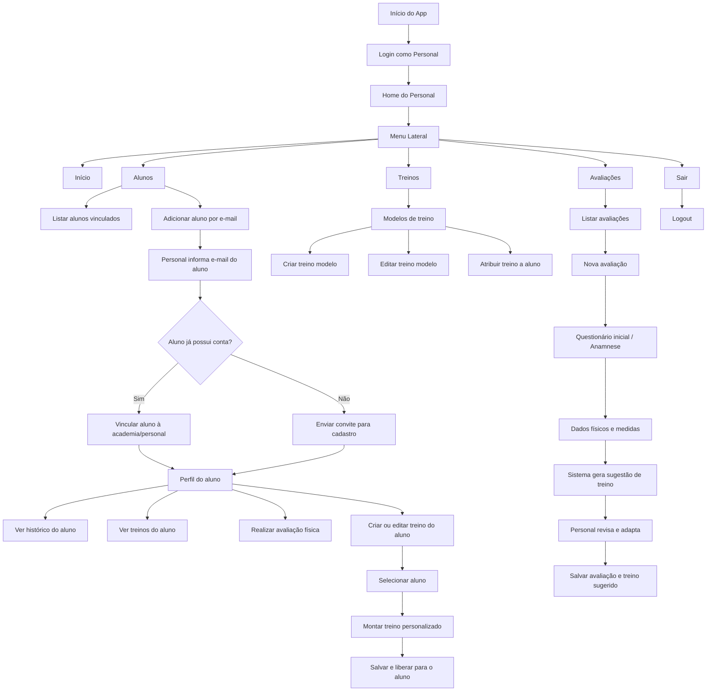

# Gym Diary

Aplicação completa para gerenciamento de treinos em academia com funcionalidades de rotinas, histórico de exercícios e progresso.


## Visão Geral

Gym Diary é uma plataforma web desenvolvida para auxiliar usuários no gerenciamento de seus treinos em academia. O sistema oferece recursos para criação de rotinas personalizadas, execução de treinos com rastreamento em tempo real, análise de histórico de exercícios e visualização de progresso.

## Informações Acadêmicas

**Professor Orientador:** [Hudson Neves](https://github.com/HudsonNeves)


*Demonstração

### Desktop
<div align="center">
  
</div>

### Mobile
<div align="center">
  
</div>

---


## Tecnologias Utilizadas

### Backend
- **Node.js** v18.0.0 ou superior
- **Express.js** 4.22.1 - Framework web
- **MySQL2** 3.20.0 - Driver para banco de dados
- **JWT (jsonwebtoken)** 9.0.3 - Autenticação e autorização
- **bcrypt** 6.0.0 - Hash de senhas
- **CORS** 2.8.6 - Controle de origem de requisições
- **dotenv** 16.6.1 - Gerenciamento de variáveis de ambiente

### Frontend
- **React** 18.2.0 - Biblioteca de UI
- **Vite** 5.0.8 - Bundler e servidor de desenvolvimento
- **React Router** 6.22.0 - Roteamento de páginas
- **Framer Motion** 11.0.0 - Animações
- **Recharts** 2.12.0 - Gráficos e visualizações

### Banco de Dados
- **MySQL** 5.7+ - Armazenamento de dados

---

## Funcionalidades Principais

### Autenticação e Autorização
- Registro de novos usuários
- Login com JWT
- Gerenciamento de perfis de usuário
- Painel administrativo

### Gerenciamento de Treinos
- Criação e gerenciamento de rotinas personalizadas
- Templates de treinos pré-definidos
- Execução de treinos com interface interativa
- Rastreamento de séries, repetições e peso

### Análise e Progresso
- Histórico detalhado de todos os exercícios realizados
- Gráficos de progresso ao longo do tempo
- Biblioteca completa de exercícios
- Dashboard com resumo de atividades

### Modo de Treinamento
- Interface dedicada para execução de treinos
- Toggle entre modo de visualização e modo de edição
- Navegação intuitiva entre exercícios

---

## Requisitos do Sistema

- Node.js v18.0.0 ou superior
- npm ou yarn como gerenciador de pacotes
- MySQL 5.7 ou superior
- Navegador moderno (Chrome, Firefox, Safari, Edge)

---

## Instalação

### 1. Clonar o repositório

```bash
git clone https://github.com/[seu-usuario]/gym-diary.git
cd gym-diary
```

### 2. Configurar Backend

```bash
cd backend
npm install
```

Criar arquivo `.env` na pasta backend:

```env
PORT=3000
NODE_ENV=development

DB_HOST=localhost
DB_PORT=3306
DB_USER=seu_usuario_mysql
DB_PASSWORD=sua_senha_mysql
DB_NAME=gym_diary

JWT_SECRET=sua_chave_secreta_jwt
```

### 3. Configurar Frontend

```bash
cd frontend
npm install
```

Criar arquivo `.env` na pasta frontend (se necessário):

```env
VITE_API_URL=http://localhost:3000/api
```

### 4. Inicializar Banco de Dados

No backend:

```bash
npm run dev
```

O script `init-db.js` será executado automaticamente na primeira inicialização, criando as tabelas necessárias.

---

## Execução

### Desenvolvimento

**Terminal 1 - Backend:**
```bash
cd backend
npm run dev
```

O servidor estará disponível em `http://localhost:3000`

**Terminal 2 - Frontend:**
```bash
cd frontend
npm run dev
```

A aplicação estará disponível em `http://localhost:5173`

### Produção

**Backend:**
```bash
cd backend
npm start
```

**Frontend:**
```bash
cd frontend
npm run build
```

---
## Dados de acesso
Aluno: aluno@teste.com
Personal: personal@teste.com
Academia: academia@teste.com
Admin: admin.teste@teste.com
Senha para todos: 123456


## Estrutura de Diretórios

```
gym-diary/
├── backend/
│   ├── config/
│   │   └── database.js           # Configuração de conexão MySQL
│   ├── controllers/
│   │   ├── authController.js     # Lógica de autenticação
│   │   ├── exerciseController.js # Gerenciamento de exercícios
│   │   ├── historyController.js  # Histórico de treinos
│   │   ├── routineController.js  # Gerenciamento de rotinas
│   │   └── templateController.js # Templates de treinos
│   ├── middlewares/
│   │   ├── auth.js               # Middleware de autenticação JWT
│   │   └── validation.js         # Validação de dados
│   ├── routes/
│   │   ├── auth.js               # Rotas de autenticação
│   │   ├── exercises.js          # Rotas de exercícios
│   │   ├── history.js            # Rotas de histórico
│   │   ├── routines.js           # Rotas de rotinas
│   │   ├── templates.js          # Rotas de templates
│   │   └── index.js              # Agregador de rotas
│   ├── utils/
│   │   └── hash.js               # Utilitários de hash
│   ├── app.js                    # Configuração Express
│   ├── server.js                 # Entrada da aplicação
│   ├── init-db.js                # Inicialização do banco
│   ├── package.json              # Dependências
│   └── .env                      # Variáveis de ambiente
├── frontend/
│   ├── src/
│   │   ├── components/           # Componentes React reutilizáveis
│   │   ├── contexts/             # Context API (Auth, Data)
│   │   ├── pages/                # Páginas principais
│   │   ├── services/             # Serviços de API
│   │   ├── utils/                # Funções utilitárias
│   │   ├── App.jsx               # Componente raiz
│   │   └── main.jsx              # Entrada da aplicação
│   ├── public/                   # Arquivos estáticos
│   ├── package.json              # Dependências
│   ├── vite.config.js            # Configuração Vite
│   └── .env                      # Variáveis de ambiente
├── render.yaml                   # Configuração de deployment
└── README.md                     # Este arquivo
```

---

## API Endpoints

### Autenticação
- `POST /api/auth/register` - Registrar novo usuário
- `POST /api/auth/login` - Login
- `POST /api/auth/logout` - Logout

### Exercícios
- `GET /api/exercises` - Listar todos os exercícios
- `POST /api/exercises` - Criar novo exercício
- `GET /api/exercises/:id` - Obter detalhes do exercício
- `PUT /api/exercises/:id` - Atualizar exercício
- `DELETE /api/exercises/:id` - Deletar exercício

### Rotinas
- `GET /api/routines` - Listar rotinas do usuário
- `POST /api/routines` - Criar nova rotina
- `GET /api/routines/:id` - Obter detalhes da rotina
- `PUT /api/routines/:id` - Atualizar rotina
- `DELETE /api/routines/:id` - Deletar rotina

### Histórico
- `GET /api/history` - Obter histórico de treinos
- `POST /api/history` - Registrar novo treino
- `GET /api/history/:id` - Obter detalhes do treino

### Templates
- `GET /api/templates` - Listar templates disponíveis
- `POST /api/templates` - Criar novo template
- `DELETE /api/templates/:id` - Deletar template

---

## Variáveis de Ambiente

### Backend (.env)

| Variável | Descrição | Padrão |
|----------|-----------|--------|
| `PORT` | Porta do servidor | 3000 |
| `NODE_ENV` | Ambiente (development/production) | development |
| `DB_HOST` | Host do MySQL | localhost |
| `DB_PORT` | Porta do MySQL | 3306 |
| `DB_USER` | Usuário MySQL | root |
| `DB_PASSWORD` | Senha MySQL | - |
| `DB_NAME` | Nome do banco de dados | gym_diary |
| `JWT_SECRET` | Chave secreta JWT | - |

### Frontend (.env)

| Variável | Descrição | Padrão |
|----------|-----------|--------|
| `VITE_API_URL` | URL base da API | http://localhost:3000/api |

---

## Deployment

### Render

A aplicação está configurada para deployment no Render através do arquivo `render.yaml`.

1. Conectar repositório GitHub ao Render
2. Selecionar branch principal
3. Configurar variáveis de ambiente no painel Render
4. Deploy será realizado automaticamente

---

## Segurança

- Senhas armazenadas com hash bcrypt
- Autenticação baseada em JWT
- CORS configurado para controlar acesso
- Validação de entrada de dados
- Proteção de rotas administrativas

---

## Contribuições

As contribuições são bem-vindas. Para contribuir:

1. Fazer fork do projeto
2. Criar branch para a feature (`git checkout -b feature/AmazingFeature`)
3. Commit das mudanças (`git commit -m 'Add some AmazingFeature'`)
4. Push para a branch (`git push origin feature/AmazingFeature`)
5. Abrir um Pull Request

---

## Roadmap

- Integração com aplicativo mobile
- Sistema de notificações push
- Suporte a múltiplos idiomas
- Análise avançada de performance
- Sistema de competições entre usuários
- Integração com dispositivos wearables

---

## Suporte

Para reportar bugs ou sugerir features, abra uma issue no repositório GitHub.

---
## Licença

Este projeto está licenciado sob a Licença MIT - veja o arquivo [LICENSE](LICENSE) para detalhes completos.

A Licença MIT é uma licença de software de código aberto permissiva que permite:

- Uso comercial
- Modificação
- Distribuição
- Uso privado

Com as seguintes obrigações:

- Incluir aviso de licença e copyright
- Incluir uma cópia da licença

---


**Última atualização:** Maio 2026


